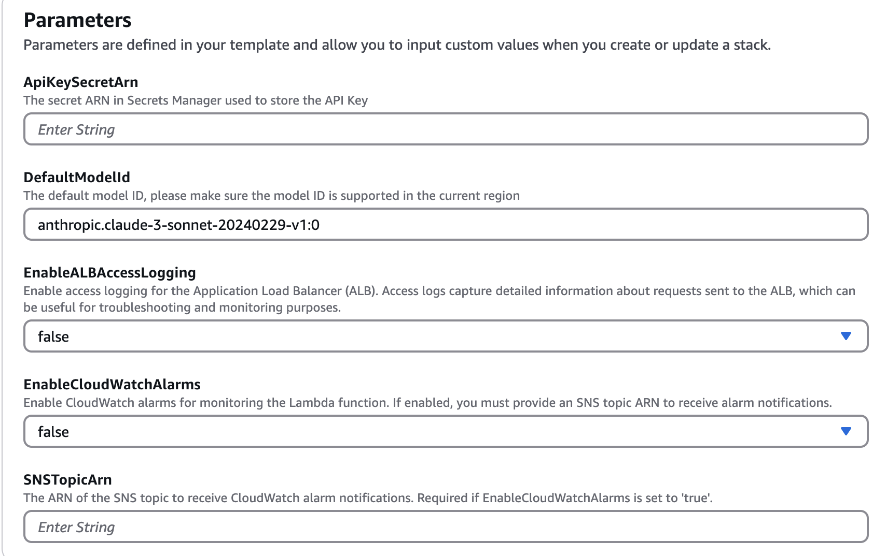
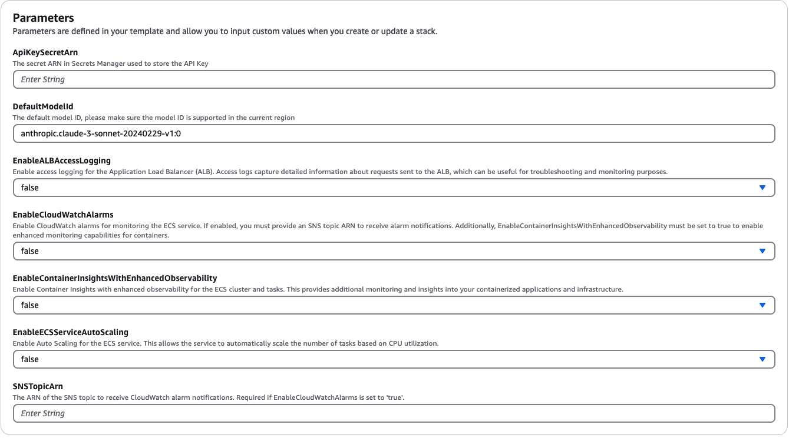

[English](./README.md)

# Bedrock Access Gateway With Observability

使用兼容OpenAI的API访问Amazon Bedrock，在原有 [Bedrock Access Gateway](https://github.com/aws-samples/bedrock-access-gateway/tree/main)方案的基础上，增加了可观测性功能，新增了监控告警功能和Fargate服务自动扩展，提升了方案的稳定性和响应能力。

## 重大变更

为了遵循安全最佳实践，本解决方案现使用 Secrets Manager 来管理 API 密钥。您必须先在 Secrets Manager 中创建 API 密钥，并定期轮换该密钥。本次更新新增了监控告警功能和Fargate服务自动扩展，提升了方案的稳定性和响应能力。

如果依然有问题，请提一个GitHub issue。


## 概述

Amazon Bedrock提供了广泛的基础模型(如Claude 3 Opus/Sonnet/Haiku、Llama 2/3、Mistral/Mixtral等),以及构建生成式AI应用程序的多种功能。更多详细信息,请查看[Amazon
Bedrock](https://aws.amazon.com/bedrock)。

有时,您可能已经使用OpenAI的API或SDK构建了应用程序,并希望在不修改代码的情况下试用Amazon
Bedrock的模型。或者,您可能只是希望在AutoGen等工具中评估这些基础模型的功能。 好消息是, 这里提供了一种方便的途径,让您可以使用
OpenAI 的 API 或 SDK 无缝集成并试用 Amazon Bedrock 的模型,而无需对现有代码进行修改。

如果您觉得这个项目有用,请考虑给它点个一个免费的小星星 ⭐。

功能列表：

- [x] 支持 server-sent events (SSE)的流式响应
- [x] 支持 Model APIs
- [x] 支持 Chat Completion APIs
- [x] 支持 Tool Call 
- [x] 支持 Embedding API 
- [x] 支持 Multimodal API 
- [x] 支持 Cross-Region Inference 
- [x] 支持 ECS Service Auto Scaling (**new**)
- [x] 支持 Cloudwatch Container Insights (**new**)
- [x] 支持 Cloudwatch Alarms (**new**)
- [x] 支持 Enable ALB Access logs (**new**)

请查看[使用指南](./docs/Usage_CN.md)以获取有关如何使用新API的更多详细信息。

## 使用指南

### 前提条件

请确保您已满足以下先决条件:

- 可以访问Amazon Bedrock基础模型。

如果您还没有获得模型访问权限,请参考[配置](https://docs.aws.amazon.com/bedrock/latest/userguide/model-access.html)指南。

### 架构图

下图展示了本方案的参考架构。请注意,它还包括一个新的**VPC**,其中只有两个公共子网用于应用程序负载均衡器(ALB)。


您也可以选择在 ALB 后面接 [AWS Fargate](https://aws.amazon.com/fargate/) 而不是 [AWS Lambda](https://aws.amazon.com/lambda/)，主要区别在于流响应的首字节延迟（Fargate更低）。

或者,您可以使用 Lambda Function URL 来代替 ALB,请参阅[示例](https://github.com/awslabs/aws-lambda-web-adapter/tree/main/examples/fastapi-response-streaming)

### 部署

请按以下步骤将Bedrock代理API部署到您的AWS账户中。仅支持Amazon Bedrock可用的区域(如us-west-2)。 部署预计用时**3-5分钟** 🕒。

**第一步: 在 Secrets Manager 中创建您的 API 密钥（必须）**

> 注意:这一步是使用任意字符串（不带空格）创建一个自定义的API Key(凭证),将用于后续访问代理API。此API Key不必与您实际的OpenAI
> Key一致,您甚至无需拥有OpenAI API Key。请确保保管好此API Key。

1. 打开 AWS 管理控制台并导航至 AWS Secrets Manager 服务。
2. 点击 "存储新密钥" 按钮。
3. 在 "选择密钥类型" 页面，选择：

   密钥类型：其他类型的密钥 键/值对：
   
   - 键：api_key
   - 值：输入您的 API 密钥值
   点击 "下一步"
4. 在 "配置密钥" 页面： 密钥名称：输入一个名称（例如："BedrockProxyAPIKey"） 描述：（可选）添加密钥的描述
5. 点击 "下一步"，检查所有设置后点击 "存储"

创建完成后，您将在 Secrets Manager 控制台中看到您的密钥。请记下密钥的 ARN。

**第二步: 部署CloudFormation堆栈**

1. 登录AWS管理控制台,切换到要部署CloudFormation堆栈的区域。
2. 单击以下按钮在该区域启动CloudFormation堆栈，选择一种方式部署。
   - **ALB + Lambda**

      []

      请使用deployment/BedrockProxyWithObservability.template 文件

   - **ALB + Fargate**

      []

      请使用deployment/BedrockProxyFargateWithObservability.template 文件

3. 单击"下一步"。
4. 在"指定堆栈详细信息"页面,提供以下信息:
    - 堆栈名称: 可以根据需要更改名称。
    - ApiKeySecretArn:输入您用于存储API 密钥的ARN。
    
  4-1. 使用Lambda部署模式

  

    EnableALBAccessLog: 如果您希望启用ALB访问日志，请将其设置为true，默认为False。单击"下一步"。

  4-2. 使用Fargate部署模式

   

    EnableCloudWatchAlarms: 如果您希望启用CloudWatch告警，请将其设置为true，默认为False。单击"下一步"。如果设置为True，请配置SNSTopicArn, 如果没有，请设置为空。SNS需要提前创建好，并且需要配置好订阅。
    

5. 在"配置堆栈选项"页面,您可以保留默认设置或根据需要进行自定义。 单击"下一步"。
6. 在"审核"页面,查看您即将创建的堆栈详细信息。勾选底部的"我确认，AWS CloudFormation 可能创建 IAM 资源。"复选框。 单击"创建堆栈"。

仅此而已 🎉 。部署完成后,点击CloudFormation堆栈,进入"输出"选项卡,你可以从"APIBaseUrl"
中找到API Base URL,它应该类似于`http://xxxx.xxx.elb.amazonaws.com/api/v1` 这样的格式。

### SDK/API使用

你只需要API Key和API Base URL。如果你没有设置自己的密钥,那么默认将使用API Key `bedrock`。

现在,你可以尝试使用代理API了。假设你想测试Claude 3 Sonnet模型,那么使用"anthropic.claude-3-sonnet-20240229-v1:0"作为模型ID。

- **API 使用示例**

```bash
export OPENAI_API_KEY=<API key>
export OPENAI_BASE_URL=<API base url>
# 旧版本请使用OPENAI_API_BASE
# https://github.com/openai/openai-python/issues/624
export OPENAI_API_BASE=<API base url>
```

```bash
curl $OPENAI_BASE_URL/chat/completions \
  -H "Content-Type: application/json" \
  -H "Authorization: Bearer $OPENAI_API_KEY" \
  -d '{
    "model": "anthropic.claude-3-sonnet-20240229-v1:0",
    "messages": [
      {
        "role": "user",
        "content": "Hello!"
      }
    ]
  }'
```

- **SDK 使用示例**

```python
from openai import OpenAI

client = OpenAI()
completion = client.chat.completions.create(
    model="anthropic.claude-3-sonnet-20240229-v1:0",
    messages=[{"role": "user", "content": "Hello!"}],
)

print(completion.choices[0].message.content)
```

请查看[使用指南](./docs/Usage_CN.md)以获取有关如何使用Embedding API、多模态API和Tool Call的更多详细信息。


## 其他例子

### LangChain

请确保使用的示`ChatOpenAI(...)` ，而不是`OpenAI(...)`

```python
# pip install langchain-openai
import os

from langchain.chains import LLMChain
from langchain.prompts import PromptTemplate
from langchain_openai import ChatOpenAI

chat = ChatOpenAI(
    model="anthropic.claude-3-sonnet-20240229-v1:0",
    temperature=0,
    openai_api_key=os.environ['OPENAI_API_KEY'],
    openai_api_base=os.environ['OPENAI_BASE_URL'],
)

template = """Question: {question}

Answer: Let's think step by step."""

prompt = PromptTemplate.from_template(template)
llm_chain = LLMChain(prompt=prompt, llm=chat)

question = "What NFL team won the Super Bowl in the year Justin Beiber was born?"
response = llm_chain.invoke(question)
print(response)

```

## FAQs

### 关于隐私

这个方案不会收集您的任何数据。而且,它默认情况下也不会记录任何请求或响应。

### 有计划支持Lambda Insights吗?

目前没有支持的Lambda Insights的计划。这取决于是否有客户需求。

### 有计划支持ALB 预置LCU应对瞬间高并发请求场景吗?

目前没有支持ALB 预置LCU的计划。这取决于是否有客户需求。

### 有计划支持Lamada Reserve Concurrency 应对瞬间高并发请求场景吗?

目前没有支持Lambda Reserve Concurrency的计划。这取决于是否有客户需求。

### 为什么没有使用API Gateway 而是使用了Application Load Balancer?

简单的答案是API Gateway不支持 server-sent events (SSE) 用于流式响应。

### 支持哪些区域?

通常来说，所有Amazon Bedrock支持的区域都支持，如果不支持，请提个Github Issue。

注意，并非所有模型都在上面区可用。

### 支持哪些模型?

你可以通过[Model API](./docs/Usage_CN.md#models-api) 获取（或更新）当前区支持的模型列表。 

### 我可以构建并使用自己的ECR镜像吗?

是的,你可以克隆repo并自行构建容器镜像(src/Dockerfile),然后推送到你自己的ECR仓库。 脚本可以参考`scripts/push-to-ecr.sh`。

在部署之前,请在CloudFormation模板中替换镜像仓库URL。

### 我可以在本地运行吗?

是的,你可以在本地运行, 例如在`src` 文件夹下运行：

```bash
uvicorn api.app:app --host 0.0.0.0 --port 8000
```

那么API Base URL应该类似于`http://localhost:8000/api/v1`

### 使用代理API会有任何性能牺牲或延迟增加吗?

与 AWS SDK 调用相比,本方案参考架构会在响应上会有额外的延迟,你可以自己部署并测试。

另外,你也可以使用 Lambda Web Adapter + Function URL (
参见 [示例](https://github.com/awslabs/aws-lambda-web-adapter/tree/main/examples/fastapi-response-streaming))来代替 ALB
或使用 AWS Fargate 来代替 Lambda,以获得更好的流响应性能。

### 有计划支持SageMaker模型吗?

目前没有支持SageMaker模型的计划。这取决于是否有客户需求。

### 有计划支持Bedrock自定义模型吗?

不支持微调模型和设置了已预配吞吐量的模型。如有需要,你可以克隆repo并进行自定义。

### 如何升级?

要使用最新功能,您无需重新部署CloudFormation堆栈。您只需拉取最新的镜像即可。

具体操作方式取决于您部署的版本:

- **Lambda版本**: 进入AWS Lambda控制台,找到Lambda 函数，然后找到并单击`部署新映像`按钮,然后单击保存。
- **Fargate版本**: 进入ECS控制台,单击ECS集群,转到`任务`选项卡,选择正在运行的唯一任务,然后点击`停止所选`菜单, ECS会自动启动新任务并且使用最新镜像。

## 安全

更多信息,请参阅[CONTRIBUTING](CONTRIBUTING.md#security-issue-notifications)。

## 许可证

本项目根据MIT-0许可证获得许可。请参阅LICENSE文件。
